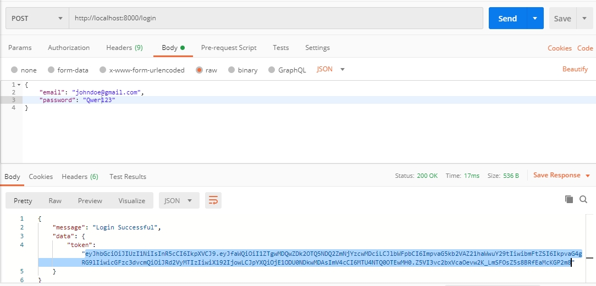

# Notepad

It is an API for Notepad App which helps to perform various functionality like creation, deletion and updation of notes. 

# Index
<ul>
<li><a href="#1">How to Setup the Code into your System</a>
<li><a href="#2">Cloning the repository using VS Code</a>
<li><a href="#3">Tech Used in it</a>
<li><a href="#4">Detailed API's Functionality</a>
<li><a href="#5">Support</a>
</ul>

# 
How to Setup the Code into your System
<ul>
<li> Fork this repository into your github account (create one if you don't have it yet)
<li> Clone it to your system (<code>git clone</code>)
<li> In the terminal run git remote add upstream <code>https://github.com/pratik-dutta/Notepad.git</code> (this is for taking a fresh update of the code anytime in the future)
</ul>

# 
Cloning the repository using VS Code
<ul >
<li> Open VS Code.
<li> Go to <i>View > Terminal</i>.
<li> To clone the repo to your desktop, change the directory to desktop by running the command <code>cd desktop</code>.
<li> In the terminal, run <code>git clone https://github.com/CodingNinjasCodes/InterQues.git</code>.
<li> A folder/directory should be created on your desktop.
<li> Open that folder in VS Code, go to <i>File > Open</i>.
<li> Run <code>npm install</code> to download dependencies of the project or you can download it by seeing dependencies in <code>package.json</code>.
<li> Now you're good to go!
</ul>

# 
Tech Used in it
<strong>Stack</strong>: NodeJs, ExpressJs, MongoDB
 
<strong>Authentication Packages</strong>: Passport, Passport JWT, jsonwebtoken
 
<strong>Uploading Files</strong>: Multer

# 
Detailed API's Functionality
 
This API helps to performs the following function
<ul>
<li><a href="#register">Register</a>
<li><a href="#login">Login</a>
<li><a href="#create">Create New Note (and Upload File)</a>
<li><a href="#get">Fetch Created Notes</a>
<li><a href="#delete">Delete Note</a>
<li><a href="#edit">Update Note</a>
</ul>
 
Following is the detailed description of all the function mentioned above. 
<ul>
<li id="register"><h2> Register </h2>
<strong>Route</strong> for register is <code>/register</code>
 
<strong>Link</strong>: <code>http://localhost:8000/register</code>
 
 
<code>Register</code> is used to create a new User into the Database of the app. 
If the email is unique, User with the given data(email, name, password) will be added to the database which you can see in the given picture below 
 

 
If the User registers from the email which is already present in the database. It'll not create the new User and dispaly the same message as well.
 

 

<li id="login"><h2> Login </h2>
<strong>Route</strong> for login is <code>/login</code>
 
<strong>Link</strong>: <code>http://localhost:8000/login</code>
 
 
<code>Login</code> is used to login the user to the app.
 
If the password and email entered is matching to the data saved in the database, User will logged in successfully.
 

 
and also create a token, which we'll use to edit, delete and update the note created by the user
 

 
And if the entered credentials are incorrect, it will give the output as
 

  

<i> To use the <code>edit</code>, <code>delete</code>, <code>udate</code> functionality we have to copy and paste the token to header as shown below</I>
 

 

 
<i>it'll authorize the user to perform the mentioned task within the expiry time specified in code which is 100s.</i> 
<i>if you are going to access the <code>edit</code>, <code>delete</code>, <code>udate</code> functions after the expiry period it will show <code>Unauthorized</code></i>.
 

 

<li id="create"><h2> Create New Note (and Upload File) </h2>
<strong>Route</strong> for Create New Note (and Upload File) is <code>/newNote</code>
 
<strong>Link</strong>: <code>http://localhost:8000/newNote</code>
 
 
<code>newNote</code> helps the user to create the note and also upload file if they want to. 
<code>Multer</code> is being used for uploading file.  
Entering <code>note</code> is necessary while <code>upload file</code> is optional.
 

 
<li id="get"><h2> Fetch Created Notes </h2>
<strong>Route</strong> for Fetch Created Notes is <code>/getNote</code>
 
<strong>Link</strong>: <code>http://localhost:8000/getNote</code>
 
 
<code>getNote</code> is used to fetch the notes created by user. 
In this API, we're fetching notes of the user who is logged in and it's identity is created is using token. 
Here is the successfull fetching of the notes by the user. 

 
<i> if there is no note created by user then, it shows something like </i> 

 
<i> if the user tries to fetch notes after expiry of token then, it shows something like </i> 

 
<li id="delete"><h2> Delete Note </h2>
<strong>Route</strong> for Delete Note is <code>/deleteNote</code> 
<i>to be specific <strong><code>/deleteNote/"noteID"</code></strong></i>
 
<strong>Link</strong>: <code>http://localhost:8000/deleteNote<i><strong>/"noteID"</strong></i></code>
 
 
<code>deleteNote</code> is used to delete the note created by the user.  
It will fetch the id from params and if the particular note is associated with the logged in user, it'll delete the note. 

 
If the id is not associated with the logged in user, it'll show message like 

 
<li id="edit"><h2> Update Note </h2>
<strong>Route</strong> for Delete Note is <code>/editNote</code> 
<i>to be specific <strong><code>/editNote/"noteID"</code></strong></i>
 
<strong>Link</strong>: <code>http://localhost:8000/editNote<i><strong>/"noteID"</strong></i></code>
 
 
<code>editNote</code> is used to update the note created by the user.  
It will fetch the id from params and if the particular note is associated with the logged in user, it'll update the note. 

 
If the id is not associated with the logged in user, it'll show message like 

 
</ul>

# 
Support
Feel free to contact at <i>pratikdutta.786(at)gmail(dot)com</i> for any query.

 

